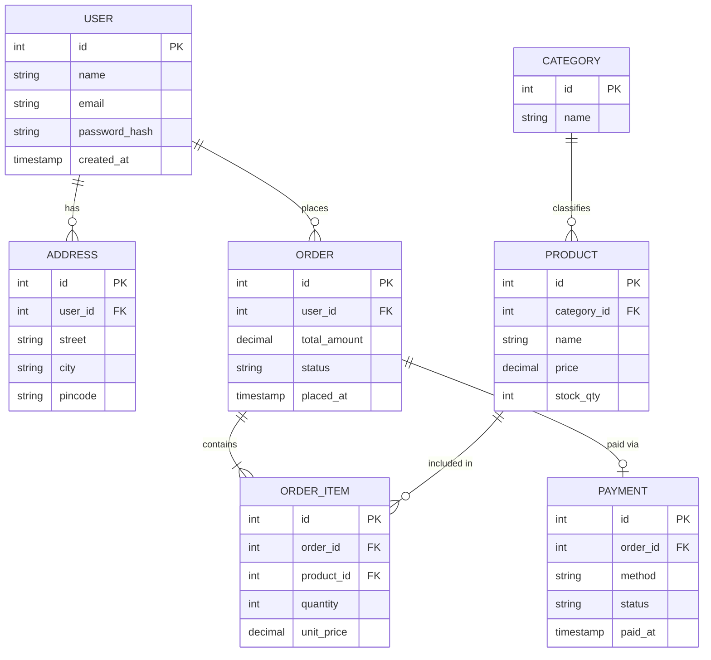

# 🗄️ The Master PostgreSQL & DBMS Interview Prep Guide
## One-Shot FAANG Revision — Definitions + SQL + ER Diagrams

---

## 📂 Table of Contents
1. [DBMS Core Fundamentals](#1-dbms-core-fundamentals)
2. [ER Diagrams — ASCII + Mermaid](#2-er-diagrams--ascii--mermaid)
3. [Database Keys & Constraints](#3-database-keys--constraints)
4. [Functional Dependencies & Armstrong's Axioms](#4-functional-dependencies--armstrongs-axioms)
5. [Normalization 1NF → 5NF (with examples)](#5-normalization-1nf--5nf-with-examples)
6. [Database Objects: Views, Procedures, Functions, Triggers](#6-database-objects-views-procedures-functions-triggers)
7. [Transactions, ACID & Isolation Levels](#7-transactions-acid--isolation-levels)
8. [Concurrency Control, Locking & Deadlocks](#8-concurrency-control-locking--deadlocks)
9. [Indexing Deep Dive](#9-indexing-deep-dive)
10. [PostgreSQL Internals: WAL, MVCC, VACUUM](#10-postgresql-internals-wal-mvcc-vacuum)
11. [Distributed Systems & Scaling](#11-distributed-systems--scaling)
12. [SQL Master Reference](#12-sql-master-reference)
13. [SQL Coding Challenges (FAANG Classics)](#13-sql-coding-challenges-faang-classics)
14. [30 High-Frequency Q&As](#14-30-high-frequency-qas)

---

## 1. DBMS Core Fundamentals

### What is a DBMS?
A **Database Management System (DBMS)** is system software that controls the creation, maintenance, retrieval, and update of structured data. It acts as an abstraction layer between physical disk storage and user applications, handling concurrency, security, and transactional safety.

**Key Responsibilities:**
- Managing physical file allocations and buffer pools
- Serving multi-user concurrency without race conditions
- Maintaining ACID transaction properties
- Mapping logical tables to optimized physical query plans
- Enforcing data access controls and schema rules

---

### DBMS vs. File System

| Feature | File System | DBMS |
| :--- | :--- | :--- |
| Data Redundancy | High (duplicate files) | Minimized via normalization |
| Consistency | Manual, error-prone | Enforced via constraints |
| Concurrency | Entire file locked | Row/page-level locking |
| Transactions | None | Full ACID support |
| Security | OS-level only | Role/column-level grants |
| Crash Recovery | Manual backup | WAL-based auto recovery |
| Query Language | Manual code | SQL (declarative) |

---

### OLTP vs. OLAP

| Property | OLTP (Online Transaction Processing) | OLAP (Online Analytical Processing) |
| :--- | :--- | :--- |
| **Purpose** | Day-to-day business operations (orders, payments) | Business intelligence & analytics |
| **Operations** | INSERT, UPDATE, DELETE | SELECT with aggregations |
| **Data Volume** | Thousands of small rows per transaction | Billions of rows per query |
| **Query Type** | Simple, indexed lookups | Complex multi-table joins, GROUP BY |
| **Normalization** | Highly normalized (3NF, BCNF) | Denormalized (star/snowflake schema) |
| **Response Time** | Milliseconds | Seconds to minutes |
| **Examples** | MySQL, PostgreSQL for apps | Redshift, BigQuery, Snowflake |

---

### Star Schema vs. Snowflake Schema (Data Warehousing)

**Star Schema:** A central **Fact Table** (e.g., `sales`) surrounded directly by **Dimension Tables** (e.g., `product`, `customer`, `time`). Dimension tables are denormalized — fast reads, some redundancy.

**Snowflake Schema:** Dimension tables are further normalized into sub-dimension tables (e.g., `product → category → department`). Less redundancy, more joins required.

```
STAR SCHEMA:
                    ┌─────────────┐
                    │  dim_time   │
                    └──────┬──────┘
                           │
┌─────────────┐    ┌───────┴───────┐    ┌─────────────┐
│ dim_product │────│  fact_sales   │────│ dim_customer │
└─────────────┘    └───────┬───────┘    └─────────────┘
                           │
                    ┌──────┴──────┐
                    │dim_location │
                    └─────────────┘
```

---

### Database Architecture
- **1-Tier:** Client, app logic, and DB all on the same machine (e.g., SQLite in a desktop app).
- **2-Tier:** Client app communicates directly with a remote DB server over a socket.
- **3-Tier:** Browser → Application Server (Spring Boot/Flask) → Database Server. The standard enterprise setup. The app server handles business logic and guards the DB.

---

### Data Independence
1. **Logical Data Independence:** Modify the logical schema (add columns, split tables) without rewriting application queries or views.
2. **Physical Data Independence:** Change physical storage (switch index type, move to SSD, repartition) without changing the logical schema.

---

## 2. ER Diagrams — ASCII + Mermaid

### What is an ER Diagram?
An **Entity-Relationship (ER) Diagram** is a visual blueprint that models the structure of a database. It shows:
- **Entities** — Real-world objects stored as tables (e.g., `User`, `Order`)
- **Attributes** — Columns of an entity (e.g., `email`, `created_at`)
- **Relationships** — How entities connect (e.g., a User *places* many Orders)
- **Cardinality** — The numeric multiplicity of relationships (1:1, 1:N, N:M)
- **Participation** — Whether participation is *total* (mandatory) or *partial* (optional)

### Cardinality Notations

```
One-to-One   (1:1)  :  |—————|
One-to-Many  (1:N)  :  |————<
Many-to-Many (N:M)  :  >————<
```

---

### E-Commerce ER Diagram — ASCII

```
┌─────────────────────┐               ┌──────────────────────────┐
│        USER         │               │         ADDRESS          │
├─────────────────────┤   1     1..N  ├──────────────────────────┤
│ PK  id (INT)        │───────────────│ PK  id (INT)             │
│     name (VARCHAR)  │               │ FK  user_id (INT)        │
│     email (VARCHAR) │               │     street (VARCHAR)     │
│     password (TEXT) │               │     city (VARCHAR)       │
│     created_at      │               │     pincode (VARCHAR)    │
└─────────┬───────────┘               └──────────────────────────┘
          │ 1
          │ places
          │ N
┌─────────┴───────────┐               ┌──────────────────────────┐
│        ORDER        │               │         PRODUCT          │
├─────────────────────┤               ├──────────────────────────┤
│ PK  id (INT)        │  N       N    │ PK  id (INT)             │
│ FK  user_id (INT)   │───────────────│     name (VARCHAR)       │
│     total_amount    │  (via         │     price (DECIMAL)      │
│     status (ENUM)   │  order_item)  │     stock_qty (INT)      │
│     placed_at       │               │ FK  category_id (INT)    │
└─────────────────────┘               └──────────┬───────────────┘
          │                                       │
          │ N:M resolved by join table            │ N
          ▼                                       │ 1
┌─────────────────────┐               ┌───────────┴──────────────┐
│     ORDER_ITEM      │               │        CATEGORY          │
├─────────────────────┤               ├──────────────────────────┤
│ PK  id (INT)        │               │ PK  id (INT)             │
│ FK  order_id (INT)  │               │     name (VARCHAR)       │
│ FK  product_id (INT)│               └──────────────────────────┘
│     quantity (INT)  │
│     unit_price      │
└─────────────────────┘
```

---

### E-Commerce ER Diagram — Mermaid (Visual)



---

### SQL to Create the E-Commerce Schema

```sql
-- CATEGORY
CREATE TABLE category (
    id SERIAL PRIMARY KEY,
    name VARCHAR(100) NOT NULL UNIQUE
);

-- PRODUCT
CREATE TABLE product (
    id SERIAL PRIMARY KEY,
    category_id INT NOT NULL REFERENCES category(id) ON DELETE RESTRICT,
    name VARCHAR(200) NOT NULL,
    price DECIMAL(10, 2) NOT NULL CHECK (price >= 0),
    stock_qty INT NOT NULL DEFAULT 0 CHECK (stock_qty >= 0)
);

-- USER
CREATE TABLE "user" (
    id SERIAL PRIMARY KEY,
    name VARCHAR(100) NOT NULL,
    email VARCHAR(255) NOT NULL UNIQUE,
    password_hash TEXT NOT NULL,
    created_at TIMESTAMP DEFAULT NOW()
);

-- ADDRESS (1:N — user has many addresses)
CREATE TABLE address (
    id SERIAL PRIMARY KEY,
    user_id INT NOT NULL REFERENCES "user"(id) ON DELETE CASCADE,
    street VARCHAR(255),
    city VARCHAR(100),
    pincode VARCHAR(20)
);

-- ORDER
CREATE TABLE "order" (
    id SERIAL PRIMARY KEY,
    user_id INT NOT NULL REFERENCES "user"(id) ON DELETE RESTRICT,
    total_amount DECIMAL(10, 2) NOT NULL,
    status VARCHAR(50) DEFAULT 'PENDING',
    placed_at TIMESTAMP DEFAULT NOW()
);

-- ORDER_ITEM (N:M join table between order and product)
CREATE TABLE order_item (
    id SERIAL PRIMARY KEY,
    order_id INT NOT NULL REFERENCES "order"(id) ON DELETE CASCADE,
    product_id INT NOT NULL REFERENCES product(id) ON DELETE RESTRICT,
    quantity INT NOT NULL CHECK (quantity > 0),
    unit_price DECIMAL(10, 2) NOT NULL
);

-- PAYMENT (1:1 or 1:N with order)
CREATE TABLE payment (
    id SERIAL PRIMARY KEY,
    order_id INT NOT NULL UNIQUE REFERENCES "order"(id) ON DELETE CASCADE,
    method VARCHAR(50),     -- 'CARD', 'UPI', 'COD'
    status VARCHAR(50),     -- 'SUCCESS', 'FAILED', 'PENDING'
    paid_at TIMESTAMP
);
```

---

## 3. Database Keys & Constraints

### Key Types Dictionary

| Key | Definition |
| :--- | :--- |
| **Super Key** | Any set of columns that uniquely identifies a row. May contain redundant columns. `{email}`, `{email, name}` are both super keys. |
| **Candidate Key** | A *minimal* Super Key — no column can be removed and still guarantee uniqueness. `{email}` is a candidate key; `{email, name}` is not (name is redundant). |
| **Primary Key (PK)** | The one chosen Candidate Key. Cannot be NULL. Exactly one per table. Auto-indexed as a clustered B-Tree. |
| **Alternate Key** | Any Candidate Key that was NOT selected as the Primary Key. E.g., if `id` is PK, then `email` (also unique) is an Alternate Key. |
| **Unique Key** | Enforces uniqueness like a PK but allows NULL (PostgreSQL allows multiple NULLs in a UNIQUE column since NULL ≠ NULL). Multiple allowed per table. |
| **Foreign Key (FK)** | A column referencing the PK/Unique Key of another table. Enforces referential integrity. |
| **Composite Key** | A key made of two or more columns together (e.g., `{order_id, product_id}` as PK in `order_item`). |
| **Surrogate Key** | An artificial, system-generated key with no business meaning (e.g., `SERIAL id`, `UUID`). |
| **Natural Key** | A key derived from real-world data with business meaning (e.g., `email`, `passport_number`, `pan_card`). |

---

### Constraints Reference

```sql
CREATE TABLE employee (
    id         SERIAL         PRIMARY KEY,              -- NOT NULL + UNIQUE + auto-index
    email      VARCHAR(255)   NOT NULL UNIQUE,          -- must exist, must be distinct
    salary     DECIMAL(10,2)  NOT NULL CHECK (salary > 0), -- must be positive
    dept_id    INT            REFERENCES department(id) ON DELETE SET NULL, -- FK
    role       VARCHAR(50)    DEFAULT 'ENGINEER',        -- fallback value
    joined_at  DATE           NOT NULL
);
```

**ON DELETE actions for Foreign Keys:**
- `CASCADE` — Deletes child rows when parent is deleted.
- `SET NULL` — Sets FK column to NULL when parent is deleted.
- `RESTRICT` — Prevents deleting parent if children exist.
- `NO ACTION` — Same as RESTRICT but deferred until end of transaction.

---

## 4. Functional Dependencies & Armstrong's Axioms

### What is a Functional Dependency?
A **Functional Dependency (FD)** `X → Y` means: if two rows have the same value for `X`, they must have the same value for `Y`. In other words, `X` *determines* `Y`.

**Example:** In an `Employee` table:
- `employee_id → name` ✅ (each ID maps to exactly one name)
- `name → employee_id` ❌ (two employees can share a name)
- `{order_id, product_id} → quantity` ✅ (composite key determines quantity)

### Types of Functional Dependencies

| Type | Description | Example |
| :--- | :--- | :--- |
| **Trivial FD** | Y is a subset of X: `X → Y` where `Y ⊆ X` | `{A, B} → A` |
| **Non-trivial FD** | Y is not a subset of X | `employee_id → salary` |
| **Partial FD** | Y depends on only *part* of a composite key | `{order_id, product_id} → order_date` (only needs `order_id`) |
| **Transitive FD** | `X → Z` via an intermediate non-key `Y`: `X → Y` and `Y → Z` | `emp_id → dept_id → dept_name` |
| **Multi-valued FD** | `X →→ Y`: One value of X maps to a set of Y values, independent of other attributes | `student →→ courses`, `student →→ hobbies` |

---

### Armstrong's Axioms (Inference Rules for FDs)

These three rules are *sound and complete* — you can derive all FDs using only these rules:

1. **Reflexivity:** If `Y ⊆ X`, then `X → Y`. (A set always determines its own subsets.)
   - `{A, B} → A` is always valid.

2. **Augmentation:** If `X → Y`, then `XZ → YZ` for any Z. (Adding the same attribute to both sides preserves the FD.)
   - If `emp_id → salary`, then `{emp_id, dept_id} → {salary, dept_id}`.

3. **Transitivity:** If `X → Y` and `Y → Z`, then `X → Z`.
   - If `emp_id → dept_id` and `dept_id → dept_name`, then `emp_id → dept_name`.

**Derived Rules** (from the above):
- **Union:** If `X → Y` and `X → Z`, then `X → YZ`.
- **Decomposition:** If `X → YZ`, then `X → Y` and `X → Z`.
- **Pseudo-transitivity:** If `X → Y` and `WY → Z`, then `WX → Z`.

---

## 5. Normalization 1NF → 5NF (with examples)

### What are Database Anomalies?
Anomalies occur in poorly structured databases with redundant data:
1. **Insertion Anomaly:** Cannot insert a record because unrelated required data is missing. E.g., cannot add a new department until at least one employee is hired.
2. **Update Anomaly:** Changing a value in one row leaves duplicates in other rows outdated, causing inconsistency. E.g., changing a department name requires updating hundreds of employee rows.
3. **Deletion Anomaly:** Deleting a record accidentally erases unrelated data. E.g., deleting the last employee in a department also deletes the department details if stored in the same table.

---

### Before Normalization — Unnormalized Table

| order_id | customer_name | customer_phone | product_ids | product_names | city | zip |
| :--- | :--- | :--- | :--- | :--- | :--- | :--- |
| 1 | Alice | 9999 | 101,102 | Phone,Laptop | Delhi | 110001 |
| 2 | Bob | 8888 | 103 | Tablet | Mumbai | 400001 |

---

### First Normal Form (1NF)
**Rule:** Every cell must hold an **atomic (single, indivisible) value**. No arrays, no comma-separated lists. Every row must be unique.

**Violation:** `product_ids = "101,102"` is not atomic.

**Fix:** Split into separate rows per product:

| order_id | customer_name | customer_phone | product_id | product_name | city | zip |
| :--- | :--- | :--- | :--- | :--- | :--- | :--- |
| 1 | Alice | 9999 | 101 | Phone | Delhi | 110001 |
| 1 | Alice | 9999 | 102 | Laptop | Delhi | 110001 |
| 2 | Bob | 8888 | 103 | Tablet | Mumbai | 400001 |

Now PK = `{order_id, product_id}` (composite).

---

### Second Normal Form (2NF)
**Rule:** Must be in 1NF + No **partial dependencies** (every non-key column must depend on the *entire* composite primary key, not just part of it).

**Violation:** `customer_name`, `customer_phone`, `city`, `zip` depend only on `order_id`, not on the full `{order_id, product_id}` key. `product_name` depends only on `product_id`.

**Fix:** Decompose into separate tables:

```sql
-- Order table (depends only on order_id)
CREATE TABLE orders (
    order_id INT PRIMARY KEY,
    customer_name VARCHAR(100),
    customer_phone VARCHAR(20),
    city VARCHAR(100),
    zip VARCHAR(10)
);

-- Product table (depends only on product_id)
CREATE TABLE products (
    product_id INT PRIMARY KEY,
    product_name VARCHAR(100)
);

-- Order-Product join table (depends on full composite key)
CREATE TABLE order_items (
    order_id INT REFERENCES orders(order_id),
    product_id INT REFERENCES products(product_id),
    PRIMARY KEY (order_id, product_id)
);
```

---

### Third Normal Form (3NF)
**Rule:** Must be in 2NF + No **transitive dependencies** (a non-key column cannot depend on another non-key column).

**Violation:** In the `orders` table: `order_id → city` and `city → zip`. So `zip` is transitively dependent on `order_id` via `city`.

**Fix:** Extract city/zip into a separate table:

```sql
CREATE TABLE locations (
    city VARCHAR(100) PRIMARY KEY,
    zip VARCHAR(10)
);

-- orders now references location
ALTER TABLE orders DROP COLUMN zip;
ALTER TABLE orders ADD COLUMN city VARCHAR(100) REFERENCES locations(city);
```

---

### Boyce-Codd Normal Form (BCNF)
**Rule:** Must be in 3NF + For every functional dependency `X → Y`, `X` must be a **Super Key** (a candidate key). Resolves edge cases where 3NF fails with overlapping candidate keys.

**Violation Example:** Table `Course_Teacher(course, teacher, textbook)` where:
- Each teacher teaches one course: `teacher → course`
- Each course uses one textbook: `{course, teacher} → textbook`
- But `teacher` is not a Super Key even though it determines `course`.

**Fix:** Decompose to ensure every left-hand side of an FD is a Super Key.

---

### Fourth Normal Form (4NF)
**Rule:** Must be in BCNF + No **multi-valued dependencies**. One key cannot independently map to multiple sets of values for two different attributes.

**Violation:** `student →→ courses` and `student →→ hobbies` in the same table causes unnecessary cross-product rows.

**Fix:** Separate `student_courses` and `student_hobbies` tables.

---

### Fifth Normal Form (5NF)
**Rule:** Must be in 4NF + No **join dependencies**. The table cannot be losslessly decomposed further into smaller tables (no information is lost when re-joined).

---

### When to Denormalize
**Denormalization** intentionally introduces redundancy (e.g., caching a user's name in every order row) to:
- Avoid expensive multi-table JOINs on read-heavy systems
- Reduce query latency in analytics/reporting
- Trade write overhead and disk space for read speed

---

## 6. Database Objects: Views, Procedures, Functions, Triggers

### 1. Views

A **View** is a named virtual table representing the result of a stored SQL query. It holds no physical data itself (unless materialized).

**Use cases:** Restrict sensitive columns from users, simplify complex multi-join queries, provide logical data independence.

```sql
-- Simple view (hides password_hash)
CREATE VIEW public_users AS
    SELECT id, name, email, created_at
    FROM "user";

-- Query the view like a normal table
SELECT * FROM public_users WHERE city = 'Delhi';

-- Drop a view
DROP VIEW public_users;
```

**Updatable View Rules:** A view is updatable only if it:
- Maps to a single base table
- Includes the PK of the base table
- Does NOT use `DISTINCT`, `GROUP BY`, `HAVING`, aggregation functions, or joins

---

### 2. Materialized Views

A **Materialized View** caches the query result physically on disk. Unlike a regular view, it is NOT recalculated on every query — it must be explicitly refreshed.

**Use case:** Expensive analytics queries that run on reporting dashboards (recalculate overnight or on a schedule).

```sql
-- Create a materialized view caching revenue per category
CREATE MATERIALIZED VIEW category_revenue AS
    SELECT c.name AS category, SUM(oi.quantity * oi.unit_price) AS revenue
    FROM order_item oi
    JOIN product p ON p.id = oi.product_id
    JOIN category c ON c.id = p.category_id
    GROUP BY c.name;

-- Manually refresh when source data changes
REFRESH MATERIALIZED VIEW category_revenue;
```

---

### 3. Stored Procedures

A **Stored Procedure** is a compiled block of SQL + procedural code stored inside the database. Called with `CALL`. Can execute transaction controls (`COMMIT`, `ROLLBACK`).

```sql
-- Stored procedure to transfer balance between accounts
CREATE OR REPLACE PROCEDURE transfer_funds(
    sender_id INT,
    receiver_id INT,
    amount DECIMAL
)
LANGUAGE plpgsql AS $$
BEGIN
    -- Deduct from sender
    UPDATE accounts SET balance = balance - amount WHERE id = sender_id;
    -- Add to receiver
    UPDATE accounts SET balance = balance + amount WHERE id = receiver_id;
    -- Commit the transaction
    COMMIT;
EXCEPTION
    WHEN OTHERS THEN
        ROLLBACK;
        RAISE;
END;
$$;

-- Call it
CALL transfer_funds(1, 2, 500.00);
```

---

### 4. Database Functions (UDFs)

A **User-Defined Function (UDF)** must return a value. Unlike stored procedures, they cannot execute `COMMIT`/`ROLLBACK` and can be embedded inside SELECT statements.

```sql
-- Function: calculate discounted price
CREATE OR REPLACE FUNCTION discounted_price(price DECIMAL, discount_pct INT)
RETURNS DECIMAL
LANGUAGE plpgsql AS $$
BEGIN
    RETURN price - (price * discount_pct / 100.0);
END;
$$;

-- Use inside a SELECT
SELECT name, price, discounted_price(price, 10) AS sale_price
FROM product;
```

**Stored Procedure vs. Function:**

| Feature | Stored Procedure | Function |
| :--- | :--- | :--- |
| Called with | `CALL proc()` | `SELECT func()` |
| Returns | Nothing or OUT params | Must return a value |
| Transaction control | YES (`COMMIT`/`ROLLBACK`) | NO |
| Used in SELECT | NO | YES |

---

### 5. Triggers

A **Trigger** executes automatically when a specified DML event (`INSERT`, `UPDATE`, `DELETE`) occurs on a table.

```sql
-- Audit log table
CREATE TABLE product_audit (
    audit_id  SERIAL PRIMARY KEY,
    product_id INT,
    old_price  DECIMAL,
    new_price  DECIMAL,
    changed_at TIMESTAMP DEFAULT NOW(),
    changed_by TEXT DEFAULT current_user
);

-- Trigger function
CREATE OR REPLACE FUNCTION log_price_change()
RETURNS TRIGGER
LANGUAGE plpgsql AS $$
BEGIN
    IF OLD.price <> NEW.price THEN
        INSERT INTO product_audit(product_id, old_price, new_price)
        VALUES (OLD.id, OLD.price, NEW.price);
    END IF;
    RETURN NEW;
END;
$$;

-- Attach trigger to product table
CREATE TRIGGER product_price_audit
AFTER UPDATE ON product
FOR EACH ROW
EXECUTE FUNCTION log_price_change();
```

**BEFORE vs. AFTER Triggers:**
- `BEFORE` — Runs before the row is written. Used to validate/modify incoming data. Can cancel the operation by returning `NULL`.
- `AFTER` — Runs after the row is written. Used for audit logs, cache updates, notifications.

---

## 7. Transactions, ACID & Isolation Levels

### Transaction Lifecycle

```
         ┌──────────┐
    ───→  │  Active  │  ← Executing SQL statements
         └────┬─────┘
              │ all statements done
              ▼
       ┌──────────────┐
       │  Partially   │  ← In-memory only, not flushed to disk
       │  Committed   │
       └──────┬───────┘
              │
      ┌───────┴────────┐
      ▼                ▼
 ┌──────────┐    ┌──────────┐
 │Committed │    │  Failed  │
 │(WAL flush│    │(error /  │
 │  to disk)│    │deadlock) │
 └──────────┘    └────┬─────┘
                      │ rollback
                      ▼
                ┌──────────┐
                │  Aborted │  ← All changes undone
                └──────────┘
```

### Transaction SQL Syntax

```sql
BEGIN;                  -- Start transaction

SAVEPOINT sp1;          -- Create a save point (partial rollback target)

UPDATE accounts SET balance = balance - 1000 WHERE id = 1;
UPDATE accounts SET balance = balance + 1000 WHERE id = 2;

ROLLBACK TO SAVEPOINT sp1;   -- Undo only back to this savepoint (not full rollback)

COMMIT;                 -- Persist all changes to disk
-- or
ROLLBACK;               -- Undo everything since BEGIN
```

---

### ACID Properties

| Property | Definition | Mechanism |
| :--- | :--- | :--- |
| **Atomicity** | All-or-nothing. If any SQL in a transaction fails, ALL changes are rolled back. | Undo logs track every change for rollback. |
| **Consistency** | A transaction can only move the DB from one valid state to another. All schema constraints (FK, CHECK, UNIQUE) must hold. | Constraint validators run before commit. |
| **Isolation** | Concurrent transactions don't interfere. Each transaction sees a consistent snapshot. | MVCC / Locking. |
| **Durability** | Once committed, data is permanently on disk and survives crashes. | Write-Ahead Log (WAL) flushes before commit confirms. |

---

### Isolation Level Anomalies Table

| Isolation Level | Dirty Read | Non-Repeatable Read | Phantom Read |
| :--- | :---: | :---: | :---: |
| Read Uncommitted | ✅ Possible | ✅ Possible | ✅ Possible |
| Read Committed | ❌ Prevented | ✅ Possible | ✅ Possible |
| Repeatable Read | ❌ Prevented | ❌ Prevented | ✅ Possible |
| Serializable | ❌ Prevented | ❌ Prevented | ❌ Prevented |

> [!NOTE]
> PostgreSQL's default is **Read Committed**. Postgres's Repeatable Read also prevents phantom reads due to MVCC snapshot semantics, making it stricter than the SQL standard.

### Anomaly Definitions

- **Dirty Read:** Transaction A reads data written by Transaction B that has **not yet committed**. If B rolls back, A has read data that never officially existed.
- **Non-Repeatable Read:** Transaction A reads a row, then Transaction B **updates & commits** that row. When A reads it again, the value has changed — the same query returns different results.
- **Phantom Read:** Transaction A runs a range query (`SELECT WHERE salary > 50000`). Transaction B **inserts a new row** matching that range and commits. When A re-runs the query, a new "phantom" row appears.

---

## 8. Concurrency Control, Locking & Deadlocks

### Lock Types

| Lock | Who can hold it | Blocks | Use case |
| :--- | :--- | :--- | :--- |
| **Shared (S)** | Multiple transactions simultaneously | Writers (X-lock) | SELECT queries |
| **Exclusive (X)** | Only one transaction | All others (S + X) | INSERT / UPDATE / DELETE |
| **Intent Shared (IS)** | Parent scope (table level) | Table-level X | Signals child row is S-locked |
| **Intent Exclusive (IX)** | Parent scope (table level) | Table-level S & X | Signals child row is X-locked |

### Lock Compatibility Matrix

|  | **S** | **X** | **IS** | **IX** |
| :--- | :---: | :---: | :---: | :---: |
| **S** | ✅ | ❌ | ✅ | ❌ |
| **X** | ❌ | ❌ | ❌ | ❌ |
| **IS** | ✅ | ❌ | ✅ | ✅ |
| **IX** | ❌ | ❌ | ✅ | ✅ |

✅ = Compatible (can be held simultaneously) | ❌ = Incompatible (must wait)

---

### Optimistic vs. Pessimistic Locking

| | Pessimistic Locking | Optimistic Locking |
| :--- | :--- | :--- |
| **Assumption** | Conflicts are common → lock immediately | Conflicts are rare → check at commit time |
| **Mechanism** | `SELECT ... FOR UPDATE` locks the row | Version column (`updated_at` / `version`) checked at UPDATE |
| **Throughput** | Lower (waits for locks) | Higher (no blocking) |
| **Use case** | High-conflict banking, inventory deduction | Low-conflict user profile updates |
| **Risk** | Deadlocks possible | Commit fails if version mismatch (retry required) |

```sql
-- Pessimistic: Lock row immediately for exclusive update
BEGIN;
SELECT * FROM product WHERE id = 1 FOR UPDATE;  -- Row locked until COMMIT
UPDATE product SET stock_qty = stock_qty - 1 WHERE id = 1;
COMMIT;

-- Optimistic: Use a version column
UPDATE product
SET stock_qty = stock_qty - 1, version = version + 1
WHERE id = 1 AND version = 5;  -- Fails if another transaction already changed it
-- Check rows_affected == 0 → retry in application code
```

---

### Two-Phase Locking (2PL)

**Two-Phase Locking** is a concurrency control protocol that guarantees **conflict serializability** (transactions produce results equivalent to some serial execution).

**Two Phases:**
1. **Growing Phase:** A transaction may acquire new locks but cannot release any.
2. **Shrinking Phase:** Once a lock is released, the transaction cannot acquire any new locks.

**Variants:**
- **Strict 2PL:** Holds ALL locks (including X-locks) until the transaction commits or aborts. Prevents cascading rollbacks. Used in most real databases.
- **Conservative 2PL:** Acquires ALL required locks before the transaction starts. Deadlock-free but requires knowing all resources upfront.

> [!IMPORTANT]
> Regular 2PL prevents non-serializable schedules but can still lead to deadlocks. Strict 2PL is the practical choice in PostgreSQL.

---

### Deadlocks

A **Deadlock** occurs when two or more transactions hold locks the other needs, creating a circular wait.

```
Transaction A:  LOCK(Row 1) → waiting for LOCK(Row 2)
Transaction B:  LOCK(Row 2) → waiting for LOCK(Row 1)
                     ← circular dependency → deadlock!
```

**Coffman's Four Conditions (all must hold for deadlock):**
1. **Mutual Exclusion** — Resources held exclusively (only one writer).
2. **Hold and Wait** — Transactions hold their current locks while requesting new ones.
3. **No Preemption** — Locks cannot be forcibly taken from a transaction.
4. **Circular Wait** — A cycle exists in the lock dependency graph.

**PostgreSQL Deadlock Handling:**
- When a transaction waits longer than `deadlock_timeout` (default: 1 second), PostgreSQL scans the lock dependency graph for circular loops.
- It selects one transaction as the "victim" (usually the one with less work done), aborts it with `ERROR: deadlock detected`, and rolls it back to free its locks.
- The other transactions can then proceed.

**Prevention Strategies:**
```sql
-- 1. Always acquire locks in a consistent global order
--    (e.g., always lock lower ID first)
BEGIN;
SELECT * FROM accounts WHERE id = 1 FOR UPDATE;  -- always lower ID first
SELECT * FROM accounts WHERE id = 5 FOR UPDATE;
COMMIT;

-- 2. Fail immediately instead of waiting
SELECT * FROM accounts WHERE id = 1 FOR UPDATE NOWAIT;
-- Raises error immediately if lock is taken (instead of waiting)

-- 3. Skip locked rows (queue processing pattern)
SELECT * FROM jobs WHERE status = 'PENDING' FOR UPDATE SKIP LOCKED LIMIT 1;
```

---

## 9. Indexing Deep Dive

### What is an Index?
An **Index** is a separate data structure (stored on disk alongside the table) that maps column values to their physical row locations, allowing the database to find rows without scanning the entire table.

**Trade-off:** Indexes speed up `SELECT` queries but slow down `INSERT`, `UPDATE`, and `DELETE` because every write must also update the index structure.

---

### Index Types

| Index Type | Structure | Best For |
| :--- | :--- | :--- |
| **B-Tree** | Balanced tree; default PostgreSQL index | Equality (`=`), range (`>`, `<`, `BETWEEN`), `ORDER BY` |
| **Hash** | Hash table of key → row pointer | Equality only (`=`). Cannot handle ranges. |
| **Bitmap** | Bit vector per distinct value | Low-cardinality columns (e.g., `gender`, `status`). Common in data warehouses. |
| **GiST** | Generalized Search Tree | Geometric data, full-text search, IP ranges |
| **GIN** | Generalized Inverted Index | JSONB columns, array columns, full-text search |

---

### Clustered vs. Non-Clustered Index

- **Clustered Index:** Physically orders table rows on disk to match the index key order. A table can have **only one** clustered index (since rows can only be sorted one way). In PostgreSQL, use `CLUSTER table_name USING index_name` to reorganize the table.
- **Non-Clustered Index:** A separate B-Tree containing (key, row_pointer) pairs. Lookup requires finding the key in the index, then following the pointer to fetch the actual row from disk. A table can have **many** non-clustered indexes.

---

### Covering Index (Index-Only Scan)

A **Covering Index** is an index that includes all columns needed by a query. PostgreSQL can answer the query entirely from the index without touching the main table heap — this is called an **Index-Only Scan**.

```sql
-- Query needs: filter by user_id, return email and created_at
SELECT email, created_at FROM "user" WHERE user_id = 42;

-- Covering index: includes ALL columns in the query
CREATE INDEX idx_user_cover ON "user"(user_id) INCLUDE (email, created_at);

-- Result: Index-Only Scan (no table heap access needed)
```

---

### Composite Index & Leftmost Prefix Rule

A **Composite Index** covers multiple columns. The leftmost prefix rule means the index can only be used if queries filter starting from the leftmost columns.

```sql
CREATE INDEX idx_order_composite ON "order"(user_id, status, placed_at);

-- ✅ Uses index (leftmost prefix: user_id)
SELECT * FROM "order" WHERE user_id = 5;

-- ✅ Uses index (leftmost prefix: user_id + status)
SELECT * FROM "order" WHERE user_id = 5 AND status = 'PAID';

-- ❌ Cannot use index (skips user_id, starts with status)
SELECT * FROM "order" WHERE status = 'PAID';
```

---

### Partial Index

An index built only on a subset of rows matching a condition. Smaller, faster for specific query patterns.

```sql
-- Index only pending orders (skip the majority of completed ones)
CREATE INDEX idx_pending_orders ON "order"(placed_at)
WHERE status = 'PENDING';
```

---

### EXPLAIN ANALYZE — Reading Query Plans

```sql
EXPLAIN ANALYZE
SELECT u.name, COUNT(o.id) AS order_count
FROM "user" u
LEFT JOIN "order" o ON u.id = o.user_id
GROUP BY u.name
ORDER BY order_count DESC;
```

**Key terms in EXPLAIN output:**
- `Seq Scan` — Full table scan. Slow on large tables → add index.
- `Index Scan` — Uses B-Tree index but still fetches heap row.
- `Index Only Scan` — Uses covering index. No heap access.
- `Hash Join` — Builds a hash table from one table to join with the other. Good for large datasets.
- `Nested Loop` — For each row of the outer table, scans inner table. Fast when inner table is small/indexed.
- `Merge Join` — Joins two sorted inputs. Efficient for large sorted datasets.
- `cost=0.00..150.00` — `startup_cost..total_cost` in arbitrary units.
- `actual time=0.05..3.2` — Real execution time in milliseconds.
- `rows=100` — Estimated vs. actual rows.
- `Buffers: hit=200` — Data served from PostgreSQL's shared buffer cache (good; means no disk I/O).

---

## 10. PostgreSQL Internals: WAL, MVCC, VACUUM

### Write-Ahead Log (WAL)

**WAL** is PostgreSQL's crash recovery mechanism. Before any data page is modified in memory, the change is first recorded sequentially in the WAL file on disk.

**Why it works:** Sequential disk writes to WAL are orders of magnitude faster than random writes to data pages. If the database crashes, PostgreSQL replays the WAL to reconstruct any changes that weren't flushed to data files yet.

**Key facts:**
- WAL enables `COMMIT` durability — a transaction is durable only after its WAL record is flushed.
- WAL powers **streaming replication** — replicas replay the primary's WAL to stay in sync.
- WAL files are stored in `pg_wal/` directory.

---

### Multi-Version Concurrency Control (MVCC)

PostgreSQL avoids read/write lock contention by keeping multiple versions of each row in the heap.

**Hidden columns on every row:**
- `xmin` — The Transaction ID (XID) that inserted this row version.
- `xmax` — The XID that deleted or updated this row (0 if still active).

**How UPDATE works in MVCC:**
1. The old row is marked deleted by setting its `xmax` to the current XID.
2. A new row version is inserted with `xmin` = current XID.
3. Both row versions coexist on disk temporarily.

**Result:** A reading transaction sees the old version; the writing transaction sees the new version. No blocking between readers and writers.

---

### VACUUM & AUTOVACUUM

**VACUUM** is PostgreSQL's garbage collector. Because MVCC leaves dead row versions (old `xmax` rows) on disk after updates/deletes, VACUUM reclaims this space.

```sql
VACUUM product;               -- Remove dead rows, reclaim space (doesn't shrink file)
VACUUM FULL product;          -- Compacts the table file (rewrites it fully, acquires lock)
VACUUM ANALYZE product;       -- VACUUM + update statistics for query planner
ANALYZE product;              -- Only update statistics (used by EXPLAIN planner)
```

**AUTOVACUUM** runs automatically in the background when a table accumulates enough dead rows (configurable threshold). It prevents table bloat and transaction ID wraparound (a critical production concern).

---

### Checkpoint

A **Checkpoint** is when PostgreSQL flushes all dirty data pages from its shared buffer cache to disk, ensuring the WAL only needs to replay from that point forward during recovery.

- Reduces crash recovery time (less WAL to replay).
- Configured via `checkpoint_timeout` (default: 5 min) and `max_wal_size`.
- Heavy checkpoints can cause I/O spikes — `checkpoint_completion_target` spreads writes out over time.

---

## 11. Distributed Systems & Scaling

### CAP Theorem

In a distributed system, during a **network partition** (nodes cannot communicate), you can only guarantee **one** of:

- **Consistency (C):** Every read returns the most recent write or an error.
- **Availability (A):** Every request gets a non-error response (may not be the latest data).
- **Partition Tolerance (P):** System keeps operating despite network failures.

> Since network partitions are unavoidable in real systems, the real choice is **CP vs. AP**:
> - **CP Systems** (prefer consistency): PostgreSQL, HBase, Zookeeper
> - **AP Systems** (prefer availability): Cassandra, DynamoDB, CouchDB

---

### Database Scaling Strategies

| Strategy | Description | Trade-off |
| :--- | :--- | :--- |
| **Vertical Scaling** | Add more CPU/RAM/SSD to existing server | Single point of failure; hardware limit |
| **Horizontal Scaling (Sharding)** | Split rows across multiple DB servers by a shard key | Cross-shard joins are complex/expensive |
| **Read Replicas** | Route SELECTs to replica servers; writes go to master | Replication lag → replicas may be slightly stale |
| **Vertical Partitioning** | Split columns into separate tables (hot vs. cold data) | Adds JOIN overhead for full records |
| **Connection Pooling** | PgBouncer proxies thousands of app connections into a few real DB connections | Reduces DB process overhead |
| **Caching Layer** | Redis/Memcached caches hot query results | Cache invalidation complexity |

---

### SQL vs. NoSQL

| Category | Data Model | Strengths | Databases |
| :--- | :--- | :--- | :--- |
| **SQL (Relational)** | Tables, rows, columns | ACID, complex joins, strong schema | PostgreSQL, MySQL |
| **Key-Value** | Key → Value map | Ultra-fast reads/writes, caching | Redis, Memcached |
| **Document** | JSON / BSON documents | Flexible schema, nested data | MongoDB, CouchDB |
| **Column-Family** | Column groups per row | High-throughput write, analytics | Cassandra, HBase |
| **Graph** | Nodes + Edges | Deeply nested relationship traversal | Neo4j, Neptune |
| **Time-Series** | Timestamped rows | Append-only, fast time-range queries | InfluxDB, TimescaleDB |
| **Search Engine** | Inverted index | Full-text search, fuzzy match | Elasticsearch |

---

## 12. SQL Master Reference

### DDL (Data Definition Language)

```sql
-- CREATE with all constraint types
CREATE TABLE employee (
    id         SERIAL PRIMARY KEY,
    email      VARCHAR(255) NOT NULL UNIQUE,
    name       VARCHAR(100) NOT NULL,
    salary     DECIMAL(10,2) CHECK (salary > 0),
    dept_id    INT REFERENCES department(id) ON DELETE SET NULL,
    role       VARCHAR(50) DEFAULT 'ENGINEER',
    joined_at  DATE NOT NULL
);

-- ALTER: add column, modify, drop, rename
ALTER TABLE employee ADD COLUMN phone VARCHAR(20);
ALTER TABLE employee ALTER COLUMN phone SET NOT NULL;
ALTER TABLE employee DROP COLUMN phone;
ALTER TABLE employee RENAME COLUMN name TO full_name;
ALTER TABLE employee RENAME TO staff;

-- CREATE INDEX
CREATE INDEX idx_emp_dept ON employee(dept_id);
CREATE UNIQUE INDEX idx_emp_email ON employee(email);
CREATE INDEX idx_emp_salary ON employee(salary DESC);

-- DROP
DROP TABLE employee CASCADE;   -- CASCADE drops dependent views/FKs too
TRUNCATE TABLE employee;       -- Delete all rows, reset sequences (faster than DELETE)
```

---

### DML (Data Manipulation Language)

```sql
-- INSERT
INSERT INTO employee (email, name, salary, dept_id, joined_at)
VALUES ('alice@corp.com', 'Alice', 90000, 1, '2023-01-15');

-- INSERT multiple rows
INSERT INTO employee (email, name, salary, dept_id, joined_at) VALUES
    ('bob@corp.com', 'Bob', 75000, 2, '2023-03-01'),
    ('carol@corp.com', 'Carol', 85000, 1, '2023-06-10');

-- INSERT ... ON CONFLICT (upsert)
INSERT INTO employee (email, name, salary, dept_id, joined_at)
VALUES ('alice@corp.com', 'Alice Updated', 95000, 1, '2023-01-15')
ON CONFLICT (email) DO UPDATE SET salary = EXCLUDED.salary, name = EXCLUDED.name;

-- UPDATE
UPDATE employee SET salary = salary * 1.1 WHERE dept_id = 1;

-- DELETE
DELETE FROM employee WHERE salary < 30000;

-- RETURNING clause (get updated/inserted values back)
UPDATE employee SET salary = salary * 1.1 WHERE id = 5 RETURNING id, salary;
```

---

### SELECT — Full Reference

```sql
SELECT DISTINCT              -- eliminate duplicate result rows
    e.id,
    e.name,
    e.salary,
    d.name AS dept_name,
    CASE
        WHEN e.salary >= 100000 THEN 'Senior'
        WHEN e.salary >= 60000 THEN 'Mid-Level'
        ELSE 'Junior'
    END AS level,
    COALESCE(e.phone, 'N/A') AS phone  -- Replace NULL with default
FROM employee e
INNER JOIN department d ON e.dept_id = d.id
WHERE e.salary > 50000
  AND e.joined_at >= '2023-01-01'
  AND e.role IN ('ENGINEER', 'MANAGER')
  AND EXISTS (SELECT 1 FROM project_assignment pa WHERE pa.emp_id = e.id)
GROUP BY e.id, e.name, e.salary, d.name
HAVING COUNT(e.id) > 0
ORDER BY e.salary DESC
LIMIT 10
OFFSET 20;
```

---

### All JOIN Types with Examples

```sql
-- Setup tables
-- employees: id, name, dept_id
-- departments: id, name

-- INNER JOIN: only rows matching in BOTH tables
SELECT e.name, d.name FROM employee e INNER JOIN department d ON e.dept_id = d.id;

-- LEFT JOIN: all employees, NULLs for employees with no department
SELECT e.name, d.name FROM employee e LEFT JOIN department d ON e.dept_id = d.id;

-- RIGHT JOIN: all departments, NULLs for departments with no employees
SELECT e.name, d.name FROM employee e RIGHT JOIN department d ON e.dept_id = d.id;

-- FULL OUTER JOIN: all rows from both, NULLs where no match
SELECT e.name, d.name FROM employee e FULL JOIN department d ON e.dept_id = d.id;

-- CROSS JOIN: Cartesian product (every employee × every department)
SELECT e.name, d.name FROM employee e CROSS JOIN department d;

-- SELF JOIN: find each employee's manager (manager_id references same table)
SELECT e.name AS employee, m.name AS manager
FROM employee e
LEFT JOIN employee m ON e.manager_id = m.id;
```

---

### Subqueries

```sql
-- Simple subquery in WHERE
SELECT name FROM employee WHERE salary > (SELECT AVG(salary) FROM employee);

-- Correlated subquery: references outer query's row — runs ONCE PER ROW
-- Find employees earning more than their department's average
SELECT e.name, e.salary, e.dept_id
FROM employee e
WHERE e.salary > (
    SELECT AVG(salary) FROM employee e2 WHERE e2.dept_id = e.dept_id
);

-- Subquery in FROM clause (inline view)
SELECT dept_name, avg_sal
FROM (
    SELECT d.name AS dept_name, AVG(e.salary) AS avg_sal
    FROM employee e JOIN department d ON e.dept_id = d.id
    GROUP BY d.name
) AS dept_stats
WHERE avg_sal > 70000;

-- EXISTS: returns TRUE if subquery finds any row (stops at first match — efficient)
SELECT name FROM employee e
WHERE EXISTS (SELECT 1 FROM project_assignment pa WHERE pa.emp_id = e.id);

-- NOT EXISTS: employees with no project assignments
SELECT name FROM employee e
WHERE NOT EXISTS (SELECT 1 FROM project_assignment pa WHERE pa.emp_id = e.id);

-- IN vs ANY vs ALL
SELECT name FROM employee WHERE salary IN (50000, 75000, 90000);
SELECT name FROM employee WHERE salary > ANY (SELECT salary FROM manager);  -- > at least one
SELECT name FROM employee WHERE salary > ALL (SELECT salary FROM manager);  -- > every one
```

---

### CTEs (Common Table Expressions)

CTEs are named subqueries defined with `WITH`. They improve readability and can be referenced multiple times. Recursive CTEs model hierarchies.

```sql
-- Simple CTE: reuse a subquery result
WITH dept_avg AS (
    SELECT dept_id, AVG(salary) AS avg_salary
    FROM employee
    GROUP BY dept_id
)
SELECT e.name, e.salary, da.avg_salary
FROM employee e
JOIN dept_avg da ON e.dept_id = da.dept_id
WHERE e.salary > da.avg_salary;

-- Recursive CTE: traverse employee → manager hierarchy
WITH RECURSIVE org_chart AS (
    -- Base case: CEO (no manager)
    SELECT id, name, manager_id, 1 AS level
    FROM employee WHERE manager_id IS NULL

    UNION ALL

    -- Recursive case: employees reporting to someone in org_chart
    SELECT e.id, e.name, e.manager_id, oc.level + 1
    FROM employee e
    INNER JOIN org_chart oc ON e.manager_id = oc.id
)
SELECT * FROM org_chart ORDER BY level;
```

---

### UNION, INTERSECT, EXCEPT

```sql
-- UNION: all rows from both, removes duplicates
SELECT name FROM employee UNION SELECT name FROM contractor;

-- UNION ALL: all rows from both, KEEPS duplicates (faster, no dedup step)
SELECT name FROM employee UNION ALL SELECT name FROM contractor;

-- INTERSECT: rows that appear in BOTH result sets
SELECT email FROM employee INTERSECT SELECT email FROM newsletter_subscriber;

-- EXCEPT: rows in first set but NOT in second set
SELECT email FROM employee EXCEPT SELECT email FROM unsubscribed;
```

---

### Window Functions

Window functions compute values **across a set of related rows** (the "window") without collapsing them into a single row like `GROUP BY` does.

```sql
-- Syntax: FUNCTION() OVER (PARTITION BY ... ORDER BY ...)
-- PARTITION BY: splits rows into groups (like GROUP BY but keeps all rows)
-- ORDER BY:     defines ordering within each partition

-- ROW_NUMBER: unique sequential number per partition (no ties)
SELECT name, dept_id, salary,
    ROW_NUMBER() OVER (PARTITION BY dept_id ORDER BY salary DESC) AS row_num
FROM employee;

-- RANK: same rank for ties, SKIPS next rank (1,1,3...)
SELECT name, dept_id, salary,
    RANK() OVER (PARTITION BY dept_id ORDER BY salary DESC) AS rank
FROM employee;

-- DENSE_RANK: same rank for ties, NO skip (1,1,2...)
SELECT name, dept_id, salary,
    DENSE_RANK() OVER (PARTITION BY dept_id ORDER BY salary DESC) AS dense_rank
FROM employee;

-- NTILE(n): divides rows into n equal buckets
SELECT name, salary,
    NTILE(4) OVER (ORDER BY salary DESC) AS salary_quartile
FROM employee;

-- LAG: access value from the PREVIOUS row
SELECT transaction_date, amount,
    LAG(amount, 1, 0) OVER (ORDER BY transaction_date) AS prev_amount
FROM transactions;

-- LEAD: access value from the NEXT row
SELECT transaction_date, amount,
    LEAD(amount, 1, 0) OVER (ORDER BY transaction_date) AS next_amount
FROM transactions;

-- SUM/AVG as window function (running total)
SELECT transaction_date, amount,
    SUM(amount) OVER (ORDER BY transaction_date ROWS BETWEEN UNBOUNDED PRECEDING AND CURRENT ROW) AS running_total,
    AVG(amount) OVER (PARTITION BY EXTRACT(MONTH FROM transaction_date)) AS monthly_avg
FROM transactions;

-- FIRST_VALUE / LAST_VALUE
SELECT name, dept_id, salary,
    FIRST_VALUE(name) OVER (PARTITION BY dept_id ORDER BY salary DESC) AS top_earner
FROM employee;
```

---

### Aggregate Functions

```sql
SELECT
    dept_id,
    COUNT(*)            AS total_employees,
    COUNT(DISTINCT role) AS unique_roles,
    SUM(salary)         AS total_payroll,
    AVG(salary)         AS avg_salary,
    MIN(salary)         AS min_salary,
    MAX(salary)         AS max_salary,
    STDDEV(salary)      AS salary_stddev,
    STRING_AGG(name, ', ' ORDER BY name) AS employee_names  -- PostgreSQL
FROM employee
GROUP BY dept_id
HAVING COUNT(*) > 2        -- filter AFTER aggregation (unlike WHERE)
ORDER BY avg_salary DESC;
```

---

### NULL Handling

```sql
-- NULL is never equal to anything, including itself
SELECT NULL = NULL;   -- returns NULL (not TRUE!)
SELECT NULL IS NULL;  -- returns TRUE

-- COALESCE: return first non-NULL value
SELECT COALESCE(phone, mobile, 'No contact') FROM employee;

-- NULLIF: return NULL if two values are equal (avoids division by zero)
SELECT salary / NULLIF(hours_worked, 0) AS hourly_rate FROM employee;

-- IS NULL / IS NOT NULL
SELECT * FROM employee WHERE manager_id IS NULL;   -- top-level employees
```

---

## 13. SQL Coding Challenges (FAANG Classics)

### Setup Tables
```sql
CREATE TABLE employee (
    id INT PRIMARY KEY, name VARCHAR(100), salary INT,
    dept_id INT, manager_id INT, joined_at DATE
);
CREATE TABLE department (id INT PRIMARY KEY, name VARCHAR(100));
```

---

### Challenge 1: Second Highest Salary
```sql
-- Method 1: OFFSET
SELECT DISTINCT salary FROM employee ORDER BY salary DESC LIMIT 1 OFFSET 1;

-- Method 2: Subquery (handles NULL if no 2nd highest)
SELECT MAX(salary) AS second_highest
FROM employee
WHERE salary < (SELECT MAX(salary) FROM employee);

-- Method 3: DENSE_RANK (most flexible for Nth highest)
SELECT salary FROM (
    SELECT salary, DENSE_RANK() OVER (ORDER BY salary DESC) AS rnk FROM employee
) ranked
WHERE rnk = 2;
```

---

### Challenge 2: Nth Highest Salary (Generic)
```sql
-- Find the Nth highest salary using DENSE_RANK
CREATE OR REPLACE FUNCTION nth_highest_salary(N INT)
RETURNS TABLE(salary INT) AS $$
BEGIN
    RETURN QUERY
    SELECT e.salary FROM (
        SELECT e.salary, DENSE_RANK() OVER (ORDER BY e.salary DESC) AS rnk
        FROM employee e
    ) ranked_e
    WHERE ranked_e.rnk = N;
END;
$$ LANGUAGE plpgsql;

SELECT * FROM nth_highest_salary(3);
```

---

### Challenge 3: Employees Earning More Than Their Manager
```sql
SELECT e.name AS employee, e.salary AS emp_salary,
       m.name AS manager,  m.salary AS mgr_salary
FROM employee e
JOIN employee m ON e.manager_id = m.id   -- SELF JOIN
WHERE e.salary > m.salary;
```

---

### Challenge 4: Top N Earners Per Department
```sql
WITH ranked AS (
    SELECT
        e.name, e.salary, d.name AS dept_name,
        DENSE_RANK() OVER (PARTITION BY e.dept_id ORDER BY e.salary DESC) AS rnk
    FROM employee e
    JOIN department d ON e.dept_id = d.id
)
SELECT dept_name, name, salary
FROM ranked
WHERE rnk <= 3     -- change N here
ORDER BY dept_name, salary DESC;
```

---

### Challenge 5: Department with Highest Average Salary
```sql
SELECT d.name AS department, ROUND(AVG(e.salary), 2) AS avg_salary
FROM employee e
JOIN department d ON e.dept_id = d.id
GROUP BY d.name
ORDER BY avg_salary DESC
LIMIT 1;
```

---

### Challenge 6: Find Duplicate Emails & Delete Them
```sql
-- Find duplicates
SELECT email, COUNT(*) FROM employee GROUP BY email HAVING COUNT(*) > 1;

-- Delete duplicates (keep lowest id)
DELETE FROM employee
WHERE id NOT IN (
    SELECT MIN(id) FROM employee GROUP BY email
);

-- PostgreSQL alternative using ctid
DELETE FROM employee a
USING employee b
WHERE a.email = b.email AND a.id > b.id;
```

---

### Challenge 7: Consecutive Duplicate Rows (Consecutive Numbers)
Find all numbers that appear at least 3 times consecutively.
```sql
-- Given table: logs(id SERIAL, num INT)
SELECT DISTINCT l1.num AS ConsecutiveNums
FROM logs l1
JOIN logs l2 ON l1.id = l2.id - 1 AND l1.num = l2.num
JOIN logs l3 ON l2.id = l3.id - 1 AND l2.num = l3.num;
```

---

### Challenge 8: Running Total (Cumulative Sum)
```sql
SELECT
    transaction_date,
    amount,
    SUM(amount) OVER (
        ORDER BY transaction_date
        ROWS BETWEEN UNBOUNDED PRECEDING AND CURRENT ROW
    ) AS running_total
FROM transactions;
```

---

### Challenge 9: Pagination (Cursor vs. OFFSET)
```sql
-- OFFSET pagination (simple but slow on large pages)
SELECT id, name, salary FROM employee
ORDER BY id
LIMIT 20 OFFSET 100;   -- Page 6 (0-indexed pages of 20)

-- Cursor-based pagination (fast, no skipping)
-- Client stores last_seen_id from previous page
SELECT id, name, salary FROM employee
WHERE id > :last_seen_id   -- :last_seen_id from previous response
ORDER BY id
LIMIT 20;
```

---

### Challenge 10: Employees Who Joined in Each Month
```sql
SELECT
    TO_CHAR(joined_at, 'YYYY-MM') AS month,
    COUNT(*) AS new_hires
FROM employee
GROUP BY TO_CHAR(joined_at, 'YYYY-MM')
ORDER BY month;
```

---

### Bonus: EXPLAIN ANALYZE on a Slow Query
```sql
-- Always run EXPLAIN ANALYZE before blaming the query!
EXPLAIN (ANALYZE, BUFFERS, FORMAT TEXT)
SELECT e.name, d.name
FROM employee e
JOIN department d ON e.dept_id = d.id
WHERE e.salary > 80000;

-- Look for:
-- "Seq Scan" on large tables → missing index
-- "Hash Join" vs "Nested Loop" → check row estimates
-- "Buffers: hit=X read=Y" → high Y means disk I/O (cache miss)
-- "actual rows" vs "rows" → large mismatch means stale statistics → run ANALYZE
```

---

## 14. 30 High-Frequency Q&As

#### Q1: What is a DBMS?
A **DBMS** is system software that controls how structured data is stored, retrieved, updated, and managed on disk. It provides an abstraction layer so that applications interact with data using high-level SQL rather than raw file I/O. A DBMS handles multi-user concurrency (locking), enforces schema constraints (foreign keys, check constraints), guarantees transactional safety (ACID), and provides query optimization (choosing the most efficient execution plan via the query planner).

#### Q2: DBMS vs. File System
A **File System** stores data in raw OS files with no built-in concurrency control, no referential integrity, no query optimizer, and no transaction support. A database crash mid-write in a file system leaves files corrupted with no recovery path. A **DBMS** enforces relational schemas to minimize redundancy, uses page-level or row-level locking for concurrent access, and writes a Write-Ahead Log (WAL) before every change — enabling automatic crash recovery by replaying the WAL on restart.

#### Q3: What is normalization?
**Normalization** is a database schema design technique that decomposes large, redundant tables into smaller, focused tables linked by foreign keys. The goal is to eliminate **insertion**, **update**, and **deletion anomalies** caused by storing the same data in multiple places. Each **Normal Form** (1NF through 5NF) applies increasingly strict rules about how columns can depend on keys. Higher normal forms eliminate more types of redundancy at the cost of more JOINs during queries.

#### Q4: Explain 1NF, 2NF, 3NF, BCNF in detail.
- **1NF:** Every cell holds one atomic value. No arrays or multi-valued attributes. All rows are unique.
- **2NF:** 1NF + no partial dependencies. Every non-key column must depend on the *entire* composite primary key, not just a part of it.
- **3NF:** 2NF + no transitive dependencies. A non-key column cannot depend on another non-key column (which depends on the PK). Example: `emp_id → dept_id → dept_name` violates 3NF; split departments into their own table.
- **BCNF:** Stricter 3NF. For every FD `X → Y`, `X` must be a Super Key. Handles edge cases with multiple overlapping candidate keys that 3NF misses.

#### Q5: What are database anomalies?
- **Insertion Anomaly:** Cannot insert new data without including unrelated data. E.g., can't store a new course until a student registers.
- **Update Anomaly:** Redundant data requires updating the same fact in many rows. Updating one and missing others creates inconsistency.
- **Deletion Anomaly:** Deleting a record destroys other important data stored in the same row. E.g., deleting the last student in a course also deletes the course details.

#### Q6: What is a primary key?
A **Primary Key** uniquely identifies each row in a table. It combines a `NOT NULL` constraint and a `UNIQUE` constraint, and PostgreSQL automatically creates a B-Tree index on it. A table can have exactly **one** primary key. It is the target of Foreign Key references from other tables. Primary keys can be single-column (e.g., `id SERIAL`) or composite (e.g., `{student_id, course_id}`).

#### Q7: Primary Key vs. Unique Key
- **Primary Key:** One per table, cannot be NULL, physically identifies the row, used as FK target.
- **Unique Key:** Multiple per table, NULL is allowed (PostgreSQL allows multiple NULLs since `NULL ≠ NULL`), used to enforce business uniqueness (e.g., `email`, `phone`). A Unique Key is an Alternate Key — it could have been chosen as the Primary Key but wasn't.

#### Q8: What is a foreign key?
A **Foreign Key** is a column that references the Primary Key (or Unique Key) of another table. It enforces **referential integrity** — you cannot insert a child row with an FK value that doesn't exist in the parent table. `ON DELETE CASCADE` propagates deletions to children; `ON DELETE RESTRICT` blocks deletion of parents that have children; `ON DELETE SET NULL` nullifies the FK column in children.

#### Q9: What are transactions?
A **Transaction** is a group of one or more SQL statements treated as a single logical unit. It begins with `BEGIN`, and ends with either `COMMIT` (permanently saves changes to disk) or `ROLLBACK` (undoes all changes). Transactions ensure that either ALL statements succeed or NONE take effect, preventing partial-write corruption.

#### Q10: Explain ACID properties in detail.
- **Atomicity:** "All or nothing." If any statement in a transaction fails, all prior statements are rolled back. Implemented via undo logs.
- **Consistency:** Every transaction moves the database from one valid state to another. All constraints (FK, CHECK, UNIQUE, NOT NULL) are validated before commit. If any constraint fails, the transaction is aborted.
- **Isolation:** Concurrent transactions behave as if they ran sequentially. Each sees a consistent snapshot, not intermediate dirty states of others. Implemented via MVCC or locking.
- **Durability:** Once committed, data survives crashes. Implemented by flushing WAL records to disk before acknowledging the commit.

#### Q11: What is an index?
An **Index** is a separate on-disk data structure (typically a B+ Tree) that maps column values to physical row locations. It allows the database to find specific rows in `O(log n)` time instead of scanning the entire table in `O(n)` time. The trade-off: indexes consume disk space and add overhead to every write because the index must be updated along with the table data.

#### Q12: Clustered vs. Non-Clustered Index
- **Clustered:** The table's physical row storage order matches the index order. Only one per table. In PostgreSQL, use `CLUSTER` command to reorganize rows. Efficient for range scans on that key.
- **Non-Clustered:** A separate B-Tree with (key → row_pointer) entries. Doesn't affect physical row order. Multiple per table. A lookup first searches the index to find the pointer, then fetches the actual row from the heap (two disk reads in the worst case).

#### Q13: What is a B+ Tree and why do databases use it?
A **B+ Tree** is a self-balancing search tree where all actual data pointers live in leaf nodes, and leaf nodes are linked in a sorted doubly-linked list. Internal nodes store only keys to guide traversal. Its wide fan-out (hundreds of keys per node, sized to match a 4KB/8KB disk block) keeps tree height at 3-4 levels for millions of records — meaning at most 4 disk reads to find any record. The leaf-level linked list enables efficient range scans (traverse leaves sequentially without backtracking). Binary Search Trees have fan-out of 2, requiring 20+ disk reads for the same dataset.

#### Q14: Explain all SQL joins.
- **INNER JOIN:** Returns only rows where the join condition matches in both tables. Non-matching rows are excluded.
- **LEFT JOIN:** Returns all rows from the left table. For right-table mismatches, columns are NULL.
- **RIGHT JOIN:** Returns all rows from the right table. For left-table mismatches, columns are NULL.
- **FULL OUTER JOIN:** Returns all rows from both tables, NULLs where no match exists on either side.
- **CROSS JOIN:** Returns the Cartesian product — every row of Table A combined with every row of Table B. `m × n` rows total.
- **SELF JOIN:** Joins a table to itself. Used to model hierarchical data (employees and their managers stored in the same table).

#### Q15: What is a view?
A **View** is a named virtual table defined by a stored SQL query. It contains no physical data (regular view). Querying a view dynamically runs the underlying query. Views simplify complex joins, restrict access to sensitive columns, and provide logical data independence. A **Materialized View** physically stores the query result on disk and must be manually `REFRESH`ed — useful for expensive analytics queries that don't need to be recalculated on every access.

#### Q16: What is a stored procedure?
A **Stored Procedure** is a precompiled named block of SQL + procedural logic (PL/pgSQL in PostgreSQL) stored inside the database. Invoked with `CALL`. Unlike functions, stored procedures can execute `COMMIT` and `ROLLBACK`, making them suitable for complex multi-step batch operations that require transaction control. Reduces network round trips by executing business logic server-side.

#### Q17: What is a trigger?
A **Trigger** is a database mechanism that automatically executes a function in response to DML events (`INSERT`, `UPDATE`, `DELETE`) on a specific table. `BEFORE` triggers can validate or modify incoming data (and cancel the operation by returning NULL). `AFTER` triggers run post-commit and are ideal for audit logging, updating cache tables, or sending notifications. Triggers are implicit — they execute without application code awareness, which can make debugging difficult.

#### Q18: What is a deadlock?
A **Deadlock** is a circular lock dependency where Transaction A holds Lock 1 and waits for Lock 2, while Transaction B holds Lock 2 and waits for Lock 1 — both wait indefinitely. PostgreSQL detects deadlocks via a background thread that scans the lock wait graph for cycles when a transaction waits longer than `deadlock_timeout`. It aborts the "victim" transaction (rolling back its changes) and lets others proceed.

#### Q19: Explain locking.
**Locking** prevents concurrent transactions from corrupting data. A **Shared (S) Lock** allows multiple readers simultaneously but blocks writers. An **Exclusive (X) Lock** is acquired by writers and blocks all other readers and writers. **Pessimistic locking** acquires locks before accessing data (`SELECT FOR UPDATE`). **Optimistic locking** uses a version column — checks at commit time if data was changed and retries if it was (no blocking, but requires application-level retry logic).

#### Q20: What are isolation levels?
Isolation levels control the degree to which concurrent transactions are shielded from each other's intermediate states:
1. **Read Uncommitted:** Can read uncommitted dirty data (dirty reads possible).
2. **Read Committed (PostgreSQL default):** Only reads committed rows. Prevents dirty reads.
3. **Repeatable Read:** Same query returns the same data throughout the transaction. Prevents dirty + non-repeatable reads.
4. **Serializable:** Full isolation — behaves as if transactions ran serially. Prevents all anomalies including phantom reads.

#### Q21: Dirty read vs. Non-repeatable read vs. Phantom read.
- **Dirty Read:** T1 reads a row modified (but not yet committed) by T2. If T2 rolls back, T1 read data that never truly existed.
- **Non-Repeatable Read:** T1 reads a row. T2 updates and commits that row. T1 re-reads and finds a different value. The same query produces different results in the same transaction.
- **Phantom Read:** T1 runs a range query (`SELECT COUNT(*) WHERE salary > 50000`). T2 inserts a new qualifying row and commits. T1 re-runs the same query and finds a new row that wasn't there before.

#### Q22: What is query optimization?
**Query optimization** is the process where the database's query planner generates multiple possible execution plans for a SQL query (choosing between index scan vs. sequential scan, nested loop vs. hash join vs. merge join) and selects the cheapest plan based on table statistics (row counts, value distributions stored in `pg_statistics`). Use `EXPLAIN ANALYZE` to inspect the chosen plan, `ANALYZE` to update statistics, and targeted indexing to guide the planner.

#### Q23: What is denormalization?
**Denormalization** deliberately reintroduces redundancy into a schema (e.g., storing `department_name` directly in the `employee` table instead of joining to `department`). It improves read performance by eliminating JOINs on heavily queried paths. The trade-offs are higher disk usage, more complex writes (must update in multiple places), and risk of data inconsistency if writes aren't handled carefully. Common in read-heavy analytics systems and OLAP data warehouses.

#### Q24: SQL vs. NoSQL.
- **SQL:** Structured schema (DDL), ACID transactions, complex multi-table joins, vertical scaling. Best for applications requiring strong consistency (banking, e-commerce).
- **NoSQL:** Flexible/dynamic schemas, horizontal scaling across many nodes, optimized for specific access patterns. Document stores (MongoDB) for nested JSON data; Key-Value (Redis) for caching; Column-Family (Cassandra) for write-heavy time-series; Graph (Neo4j) for relationships. BASE model (Basically Available, Soft state, Eventually consistent) instead of ACID.

#### Q25: What is sharding?
**Sharding** horizontally partitions a table's rows across multiple physical database servers based on a **shard key**. E.g., users with `id % 2 == 0` go to Shard A; `id % 2 == 1` go to Shard B. This distributes storage and query load. Challenges include: cross-shard JOINs become network calls, distributed transactions are complex, and resharding (rebalancing when adding servers) requires data migration. Common shard key strategies: **Range-based** (user IDs 1-1M on Shard 1), **Hash-based** (`hash(user_id) % N`), **Directory-based** (lookup table maps keys to shards).

#### Q26: What is replication?
**Replication** copies data from a primary (master) server to one or more replica (standby) servers. **Synchronous replication:** the primary waits for at least one replica to confirm WAL receipt before acknowledging commit — zero data loss, but higher write latency. **Asynchronous replication:** the primary commits immediately and replicates in the background — lower latency but replicas may be slightly behind (replication lag). Read replicas offload SELECT queries from the primary. If the primary fails, a replica can be promoted (failover).

#### Q27: What is CAP theorem?
In a distributed system, during a **network partition** (nodes can't communicate), the system must choose between **Consistency** (return only up-to-date data or error) and **Availability** (always return a response, possibly stale). Since partitions are unavoidable in distributed networks, CAP says you choose CP or AP. PostgreSQL with synchronous replication is CP (may reject writes during partition to maintain consistency). Cassandra is AP (always serves reads, may return stale data during partition).

#### Q28: How do databases ensure consistency?
1. **Constraint enforcement:** FK, CHECK, UNIQUE, NOT NULL are validated before committing each transaction.
2. **WAL durability:** Changes are written to the Write-Ahead Log before being acknowledged as committed, surviving crashes.
3. **Isolation:** MVCC snapshots or locks ensure each transaction sees a consistent view without reading partial writes from concurrent transactions.
4. **Two-Phase Commit (2PC):** In distributed databases, the coordinator asks all participant nodes to prepare, then sends a global commit only if all respond "ready."

#### Q29: How would you design a database for an e-commerce system?
Use normalized tables: `user`, `address` (1:N with user), `category`, `product` (FK to category), `order` (FK to user), `order_item` (join table: order + product with quantity and unit_price snapshot), `payment` (FK to order). Key design decisions: snapshot `unit_price` in `order_item` so historical orders don't change when product price changes. Use `SERIALIZABLE` or `REPEATABLE READ` isolation during checkout with `SELECT FOR UPDATE` on product stock to prevent overselling. Index `order.user_id`, `order_item.order_id`, `product.category_id`.

#### Q30: How do you optimize a slow SQL query?
1. Run `EXPLAIN (ANALYZE, BUFFERS)` to find sequential scans, high actual row counts, and disk reads (Buffers: read).
2. Create indexes on columns used in `WHERE`, `JOIN ON`, and `ORDER BY` clauses.
3. Use composite indexes in the correct column order (leftmost prefix rule).
4. Use covering indexes (`INCLUDE`) to enable Index-Only Scans.
5. Use `ANALYZE` to update table statistics if planner estimates are wildly off.
6. Replace correlated subqueries with JOINs or CTEs where possible.
7. Avoid `SELECT *` — fetch only needed columns (helps covering indexes).
8. Use `LIMIT` for pagination; prefer cursor-based pagination over `OFFSET` on large tables.
9. Partition large tables by date range so queries only scan relevant partitions.
10. Check for N+1 query patterns in ORM code — use `JOIN FETCH` or `@EntityGraph` in JPA.
